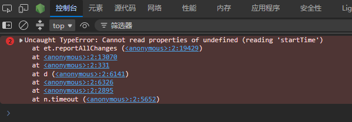
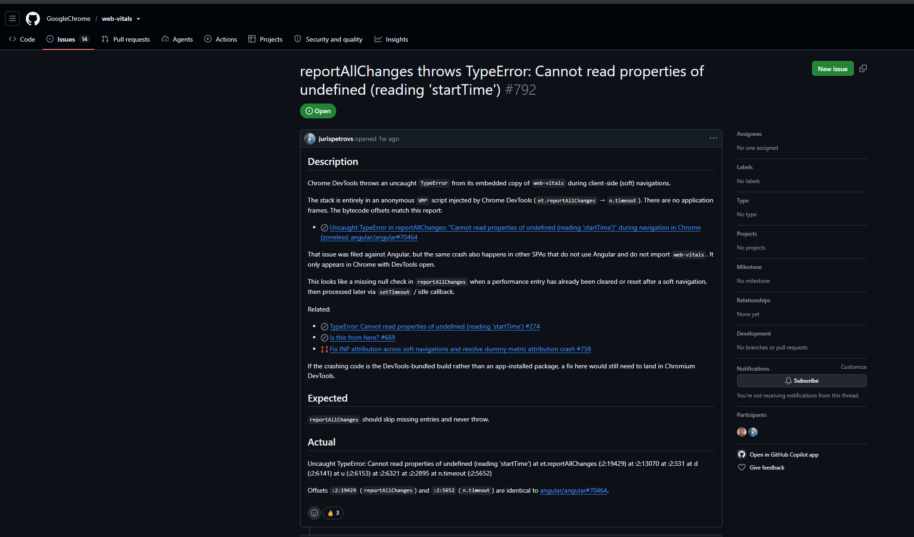

# DevTools 报错：`Cannot read properties of undefined (reading 'startTime')`

## 前言
我在调试博客时，控制台一直在报这个问题，就很烦。排查了很久，起初以为是我后台某个属性返回的字段是 `undefined`，然后又去调用了 `startTime`，折腾了好久，今天实在看不下去了，故而彻底排查了一遍，最后发现居然还不是我代码的问题，特此记录。

> 排查定论（2026-09-05）：该报错来自 **Chromium/Edge DevTools 自身的 Live Metrics（性能/性能洞察）面板**注入的 web-vitals 内联脚本，**与本站代码、依赖、后端数据均无关**。

## 现象

控制台偶发报错：
```
Uncaught TypeError: Cannot read properties of undefined (reading 'startTime')
    at et.reportAllChanges (<anonymous>:2:19429)
    at n.timeout (<anonymous>:2:5652)
```



报错栈在 `VM<编号>` 匿名脚本里，**没有任何应用代码调用栈**。

## 根因

报错来自 DevTools 内嵌的一份 **web-vitals v6** 副本（附 THRESHOLDS + attribution + Live Metrics 上报，含 `window.devToolsReportSoftNavs=true` 与 `window.__chromium_devtools_metrics_reporter`）。

崩溃点是 INP 上报回调中的空值访问：

```js
et(t => {
    ut({
        name: "INP",
        ...
        startTime: t.entries[0].startTime,          // entries 为空数组时 [0] 为 undefined
        entryGroupId: t.entries[0].interactionId,
    })
}, { reportAllChanges: !0, ... })
```

触发条件：**软导航（SPA 客户端路由切换）**后，DevTools 的 web-vitals 内部 `_estimateP98LongestInteraction` 会返回一个 `entries: []` 的合成指标，随后的回调再读 `entries[0]` 就崩溃。它由 `requestIdleCallback` 异步触发，所以出现在 `n.timeout` 帧里。

## 为什么不是本站的问题

- 全仓源码、`dist`、全部 `node_modules`、Vite 预构建缓存中**均无 web-vitals / `reportAllChanges`**。
- 无头 / 无 DevTools 的干净浏览器加载本站**无此报错**。
- **打开 DevTools 后访问任意第三方网页同样报错** → 与本站后端返回的文章字段（哪怕为 null）毫无关系；`t.entries` 不是 API 数据。
- 报错内容与官方报告的 stack 完全一致。

## 关键证据

- 报错脚本首行：`window.devToolsReportSoftNavs = true;` —— DevTools Live Metrics 标志
- 报错脚本末尾：`window.__chromium_devtools_metrics_reporter?.()` —— Chromium Live Metrics 上报器
- 官方 Issue：GoogleChrome/web-vitals#792、angular/angular#70464 均标注为 **upstream Chromium DevTools 问题**。
- Chromium 官方：issues.chromium.org/543499029，状态 **Fixed**，补丁为「Live Metrics: Handle empty INP entries」（`t.entries[0]?.startTime` 可选链），已合入 **Chrome 153**。

## 相关说明文章（官方链接）

1. **Chromium 官方 Bug 跟踪**（最权威，已确认为 DevTools bug 并已修复）
   - 链接：https://issues.chromium.org/issues/543499029
   - 标题：《[DevTools] SoftNav instrumentation (devToolsReportSoftNavs) throws TypeError in requestIdleCallback》
   - 说明：明确把报错定位为 DevTools Performance 面板（Live Metrics）注入的 web-vitals 的问题；精确解释了根因——`t.entries[0].startTime` / `t.entries[0].interactionId` 在软导航后 `entries` 为空数组时崩溃；状态 **Fixed**，修复已合入 **Chrome 153**（补丁：Handle empty INP entries，用可选链 `t.entries[0]?.startTime`）。

2. **web-vitals 官方 GitHub Issue #792**（英文说明）
   - 链接：https://github.com/GoogleChrome/web-vitals/issues/792
   - 标题：《reportAllChanges throws TypeError: Cannot read properties of undefined (reading 'startTime')》
   - 说明：同样是「Chrome DevTools 打开时才出现」「VM\* 匿名脚本」「非应用代码」的报告；维护者 confirm：这是 DevTools 内嵌 web-vitals 的问题，指向上面的 Chromium issue。

3. **Angular 官方 Issue #70464**（附带详细分析）
   - 链接：https://github.com/angular/angular/issues/70464
   - 说明：带一段很好的技术讲解——为什么软导航后 `entries` 清空、`requestIdleCallback` 里崩溃；结论：upstream Chromium DevTools 问题，非用户代码。

## 参考链接

- Chromium Bug（最权威）：https://issues.chromium.org/issues/543499029
- web-vitals Issue #792：https://github.com/GoogleChrome/web-vitals/issues/792
- angular Issue #70464（含技术分析）：https://github.com/angular/angular/issues/70464



## 如何消除 / 规避

该报错**无害**、不影响任何功能。要消除：

1. **升级浏览器**到 Chrome / Edge ≥ **153**（官方 bug 已在该版本修复）。
2. **临时规避**：关闭 DevTools（`F12`），或退出 DevTools 的 **Performance / 性能洞察（Live Metrics）** 面板。
